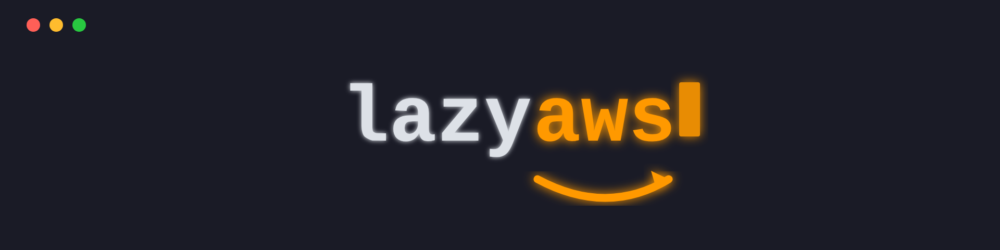

<p align="center">
  
</p>

<p align="center">
  A terminal UI for browsing AWS resources — inspired by
  <a href="https://github.com/jesseduffield/lazygit">lazygit</a> and
  <a href="https://github.com/jesseduffield/lazydocker">lazydocker</a>.
</p>

<p align="center">
  <a href="https://github.com/bkneis/lazyaws/releases"></a>
  <a href="https://pkg.go.dev/github.com/bkneis/lazyaws"></a>
  <a href="LICENSE"></a>
  <a href="https://github.com/bkneis/lazyaws/actions"></a>
</p>

---

<p align="center">
  
</p>

---

## Why

The AWS CLI is powerful but slow for exploratory workflows. Finding a Lambda's env vars, checking a CloudFormation stack's outputs, or inspecting an SQS dead-letter queue means multiple commands with long argument lists.

`lazyaws` puts all of that in a three-panel TUI you can navigate in seconds — no flags to remember, no context-switching to the browser console.

It pairs naturally with **LocalStack-based development**: run `lazyaws -local` alongside `docker compose up` to inspect your emulated AWS environment in real time, the same way you'd use `lazydocker` to inspect containers. It also works as a lightweight **read-only monitoring tool** against real AWS environments.

## Install

```bash
go install github.com/bkneis/lazyaws@latest
```

Or download a pre-built binary from the [releases page](https://github.com/bkneis/lazyaws/releases).

## Usage

```bash
# Against your default AWS profile / region
lazyaws

# Against LocalStack (http://localhost:4566)
lazyaws -local
```

AWS credentials are loaded from the standard chain (`AWS_*` environment variables, `~/.aws/credentials`, IAM instance role, etc.).

## Keybindings

| Key | Action |
|-----|--------|
| `Tab` / `Shift+Tab` | Cycle focus between panels |
| `j` / `k` or `↓` / `↑` | Navigate lists |
| `[` / `]` | Previous / next detail tab |
| `r` | Refresh current resource list |
| `q` | Quit |

## Cool Features

- S3 Explorer with ability to view text / json files and download items
- Cloudwatch Logs Viewer
- DynamoDB viewer for easily inspecting JSON objects
- Completely clickable TUI, no need to learn keyboard shortcuts if you don't want to
- Cross resource linking, click underscored hyperlinks in resource lists to jump to that resouce
- Single binary ~21mb that works across window, linux and mac 32/64bit
- Point it at any AWS control plane such as localstack using --entrypoint-url
- Doesn't require aws cli to be installed or use any porcelin command processing, entirely built using go aws sdk and uses your local authentication configured

## Supported Services

| Service | Detail tabs |
|---------|-------------|
| S3 | Overview, Objects, Policy |
| Lambda | Overview, Env vars, Triggers |
| SNS | Overview, Subscriptions |
| SQS | Overview, Config, DLQ |
| CloudFormation | Overview, Resources, Outputs, Parameters |
| IAM Roles | Overview, Policies, Trust policy |
| IAM Policies | Overview, Document |
| Secrets Manager | Overview, Value, Versions |
| API Gateway (v1 + v2) | Overview, Routes/Resources, Stages |
| Route 53 | Overview, Records |
| ACM | Overview, Domains, Validation |
| DynamoDB | Overview, Items, Indexes |
| Kinesis | Overview, Shards |
| KMS | Overview, Aliases |
| Step Functions | Overview, Executions |
| CloudWatch | Overview, Metrics |
| CloudWatch Logs | Overview, Log streams |
| EventBridge | Overview, Rules |
| EC2 Instances | Overview, Tags |
| EC2 VPCs | Overview, Subnets |
| EC2 Security Groups | Overview, Rules |
| EC2 Volumes | Overview, Attachments |
| EC2 AMIs | Overview, Block devices |
| Elastic Load Balancers | Overview, Listeners, Target groups |
| Auto Scaling Groups | Overview, Instances |

## Contributing

I'd welcome any contrubtions from the community, if anyone wants to suggest/implement new features or integrate AWS services then please read CONTRUBTING.md and submit a PR :)

## License

[MIT](LICENSE) © bkneis
