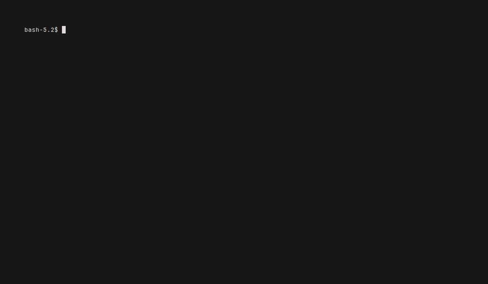

<p align="center">
  
</p>

<p align="center">
  A terminal UI for managing AWS resources — inspired by
  <a href="https://github.com/jesseduffield/lazydocker">lazydocker</a>,
  <a href="https://github.com/jesseduffield/lazygit">lazygit</a>.
</p>

<p align="center">
  <a href="https://github.com/bkneis/lazyaws/releases"></a>
  <a href="https://pkg.go.dev/github.com/bkneis/lazyaws"></a>
  <a href="LICENSE"></a>
  <a href="https://github.com/bkneis/lazyaws/actions"></a>
  <a href="https://hub.docker.com/r/bkneis/lazyaws"></a>
</p>

---

<p align="center">
  
</p>

---

The aim of this project is to make it easier to navigate, observe and manage your infrastucture, whether in the wild or locally during development.

## Why

The AWS CLI is powerful but slow for exploratory workflows. Finding a Lambda's env vars or inspecting an SQS queue can require multiple commands with long argument lists.

`lazyaws` puts all of that in a three-panel TUI you can navigate in seconds — no flags to remember, no context-switching to the browser console and waiting for static assets to load.

It pairs naturally with **LocalStack-based development**: run `lazyaws -local` or `lazyaws -entrypoint-url=<aws control plane>` to inspect your emulated AWS environment in real time, the same way you'd use `lazydocker` to inspect containers.

My typicaly workflow while using AI tools like claude include providing verification loops such as restarting a localstack container and re deploying cloudformation templates to fix infrastructure issues. With lazyaws, you can easily observe this in real time while the agent is working. Or if an integration test fails, and leaves the resources deployed, it can be inspected quickly and easily without leaving the terminal.

## Install

**macOS / Linux**
```bash
brew install bkneis/lazyaws/lazyaws
```

**Linux packages**
```bash
# Debian/Ubuntu
sudo dpkg -i lazyaws_*.deb     # download .deb from GitHub Releases

# RPM-based
sudo rpm -i lazyaws_*.rpm      # download .rpm from GitHub Releases
```

**Windows**
```bash
scoop bucket add lazyaws https://github.com/bkneis/scoop-lazyaws
scoop install lazyaws
```

**Docker (all platforms)**
```bash
alias lazyaws=$(docker run --rm -it \
  -e AWS_ACCESS_KEY_ID \
  -e AWS_SECRET_ACCESS_KEY \
  -e AWS_DEFAULT_REGION \
  bkneis/lazyaws)
```

For LocalStack, pass `--network host -e AWS_ENDPOINT_URL=http://localhost:4566`.

**go install / binary**
```bash
go install github.com/bkneis/lazyaws@latest
```

Or download a pre-built binary (Windows/macOS/Linux, amd64/arm64) from the [releases page](https://github.com/bkneis/lazyaws/releases).

## Usage

```bash
# Against your default AWS profile / region
lazyaws

# Against LocalStack (http://localhost:4566)
lazyaws -local
```

AWS credentials are loaded from the standard chain (`AWS_*` environment variables, `~/.aws/credentials`, IAM instance role, etc.).

## Cool Features

- **Cloudwatch Logs Viewer** with multi-group streaming and JSON support
- **S3 Explorer** with ability to view/edit text & json files and download items
- **DynamoDB Browser** for viewing / inserting JSON
- **Completely Clickable TUI** mouse support, no need to learn keyboard shortcuts
- **Actions Menu** (`x`) for interactive commands: send SQS/SNS messages, invoke Lambda functions, create snapshots, and more
- **Copy and Paste Capability** by switching mouse mode using (M)
- **Cross Resource Links** — resource arns are clickable and underlined to jump to that resource
- **Connect to EC2 Instances** via SSH or AWS SSM Session Manager directly from the list
- **Launch a DB Shell** for RDS instances — infers `psql` or `mysql` connection string from instance details
- **Exec into ECS Containers** via `aws ecs execute-command`
- Fast grep like search across your infrastucture using `/`
- Single binary ~28mb that works across Windows, Linux and Mac 32/64bit
- Doesn't require the AWS CLI to be installed — built entirely on the Go AWS SDK using your local credentials

---

If you find this useful, consider giving it a ⭐ — it helps others discover the project.

---

## Keybindings

| Key | Action |
|-----|--------|
| `Tab` / `Shift+Tab` | Cycle focus between panels |
| `j` / `k` or `↓` / `↑` | Navigate lists |
| `[` / `]` | Previous / next detail tab |
| `/` | Search / filter current resource list |
| `r` | Refresh current resource list |
| `x` | Open actions menu for selected resource |
| `R` | Switch AWS region |
| `q` | Quit |

## Supported Services

| Service | Detail tabs | Actions |
|---------|-------------|---------|
| S3 | Overview, Objects, Policy, Content | Upload, download, delete objects; create/delete buckets |
| Lambda | Overview, Env vars, Triggers | Invoke function, delete function |
| SNS | Overview, Subscriptions | Create/delete topic, subscribe, publish message |
| SQS | Overview, Config, DLQ, Messages | Create/delete queue, send message, purge |
| CloudFormation | Overview, Resources, Outputs, Parameters, Events | — |
| IAM Roles | Overview, Policies, Trust policy | — |
| IAM Policies | Overview, Document | — |
| Secrets Manager | Overview, Value, Versions | Create/delete secret, update value |
| API Gateway (v1 + v2) | Overview, Routes/Resources, Stages | — |
| Route 53 | Overview, Records | Create/delete zone, create/update/delete records |
| ACM | Overview, Domains, Validation | — |
| DynamoDB | Overview, Items, Indexes, Backups | Create/delete table, put item, create backup |
| Kinesis | Overview, Shards, Consumers, Records | Create/delete stream, put record |
| KMS | Overview, Policy, Aliases | — |
| Step Functions | Overview, Definition, Executions | — |
| CloudWatch Alarms | Overview, History | — |
| CloudWatch Logs | Overview, Streams, Tail | Create/delete log group, set retention |
| EventBridge | Overview, Targets | — |
| EC2 Instances | Overview, Network, Storage, Tags | Start, stop, reboot, terminate; **connect via SSH or SSM** |
| EC2 VPCs | Overview, Subnets, Route Tables | — |
| EC2 Security Groups | Overview, Inbound Rules, Outbound Rules | Delete security group |
| EC2 Volumes | Overview, Snapshots | — |
| EC2 AMIs | Overview, Block Devices | — |
| Elastic Load Balancers | Overview, Listeners, Target Groups | — |
| Auto Scaling Groups | Overview, Instances, Scaling Policies, Activities | — |
| RDS | Overview, Connectivity, Config, Snapshots | Start, stop, reboot, snapshot, delete; **launch DB shell (psql/mysql)** |
| ECS | Overview, Services, Tasks | **Exec into container** |
| SSM Parameter Store | Overview, Value (decrypted), History | — |

## Configuration & Theming

lazyaws auto-detects your terminal color scheme (dark, light, or Warp). To customise the theme, create a config file at:

| Platform | Config file location |
|----------|---------------------|
| **Linux / macOS** | `~/.config/lazyaws/config.yaml` |
| **Linux / macOS** (XDG) | `$XDG_CONFIG_HOME/lazyaws/config.yaml` |
| **Windows** | `%USERPROFILE%\.config\lazyaws\config.yaml` |

An annotated example config with all available options and preset themes is included in [`config.example.yaml`](config.example.yaml).

```yaml
# ~/.config/lazyaws/config.yaml
theme:
  focus_color: "#ff9900"       # AWS orange borders + selection highlight
  selection_text: "black"
  highlight_tag: "[#ff9900]"
  header_tag: "[#ff9900]"
  active_tab_tag: "[#ff9900]"
  inactive_tab_tag: "[gray]"
  link_tag: "[#ff9900::u]"
```

Color values accept named tcell colors (`"aqua"`, `"green"`, `"blue"`, etc.) or hex strings (`"#ff9900"`). All fields are optional — omit any key to keep the auto-detected default.

## Contributing

I'd welcome any contrubtions from the community, if anyone wants to suggest/implement new features or integrate AWS services then please read CONTRUBTING.md and submit a PR :)

## License

[MIT](LICENSE) © bkneis
